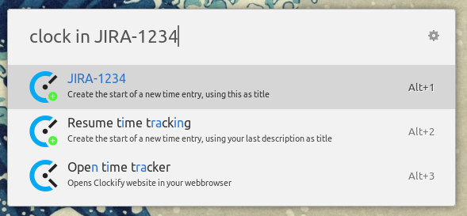
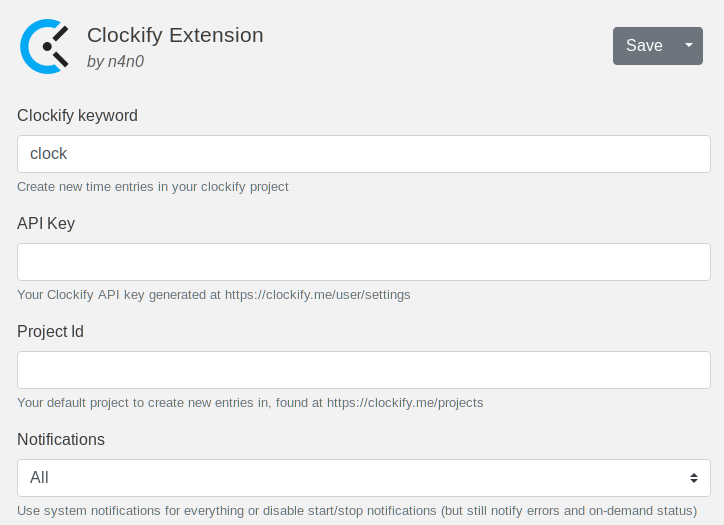

# UlauncherClockify
A Clockify extension for Ulauncher.

## Install
* Open Ulauncher preferences
* Go to 'extensions'
* Click on 'add extension'
* Paste `https://github.com/n4n0GH/ulauncher_clockify` and confirm

## Setup
You're going to be copypasting a few things from the Clockify website into the extension's settings. So open up the Ulauncher preferences window and go to the extensions tab, then select the Clockify extension.

### API Key & Project Id
Since this is supposed to communicate with an API, we need some basic information.

Go to https://clockify.me/user/settings and scroll down until you can see 'API Key'. Click the generate button and copy that fresh API Key into the Ulauncher extension settings where it says 'API Key'. Don't worry, it stays on your machine.

Next up you need a default project to create new entries in. Head over to https://clockify.me/projects and just click on the one you think makes the most sense. Once the page has loaded take a look at the URL in your browser. It should look like `https://clockify.me/projects/YOUR-CRYPTIC-ID-HERE/edit`. Copy that Id part into the Ulauncher extension settings where it says 'Project Id'.

Now hit the 'Save' button on top and you're all set up!

## Usage
Invoke the extension with the default keyword `clock`.

Basic command structure is like so: `clock (in <args>|out)`.

### Creating new time entries
Using `clock in` will fetch the title of your most recent time entry and re-use that.

`clock in foo` will create a new time entry with the title `foo`.

`clock out` will stop any ongoing time trackings. This takes no further arguments.
